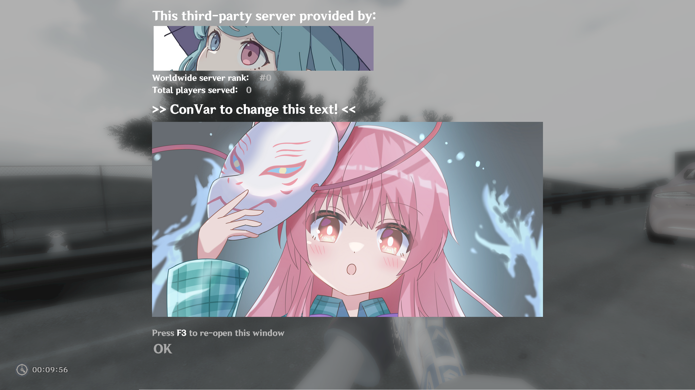

Change the title as seen in this screenshot

## RANT
i originally went into this with the goal of modifying the text that appears above/below the hostfile banner. It would be so cool to remove that text and have just the banner itself. Manually invoke it to display, have it display a different image depending on what a plugin decides. Wouldn't that be so cool? Like have a notification system for things like "tank has spawned" etc but done in a much more visually pleasing way, not requiring the clients install any mods.

But unfortunately, the only text that can be modified is the title of the motd. I feel like i've exhausted every possibility, so the original thing i wanted to make isn't possible unless i want the notification banner to always be cluttered with irrelevant text (also wtf even is half the text for? worldwide rank? number of players served? where is it even pulling numbers for these from?).

Being able to modify the motd title is at least *something*, so i might as well make it into a plugin so that i don't feel like i wasted my time.

If someone reading this has found a way to achieve my original goal, please please [contact me](https://steamcommunity.com/id/neburai/) about it